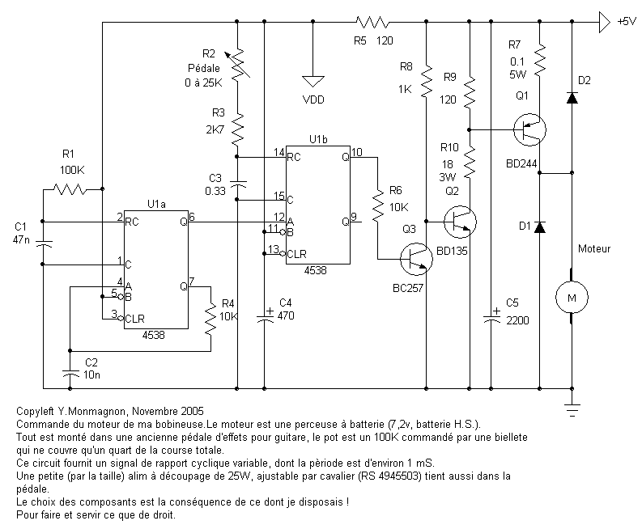

Preamp_micro_USB
================

The project describes a stand-alone coil winder

If you would have more information about this project please visit 
www.audiyofan.org

A link to the dedicated post 
http://www.audiyofan.org/forum/viewtopic.php?f=73&t=7176&start=105

PCB & schema are designed with Kicad

All comments are welcome

Totof

